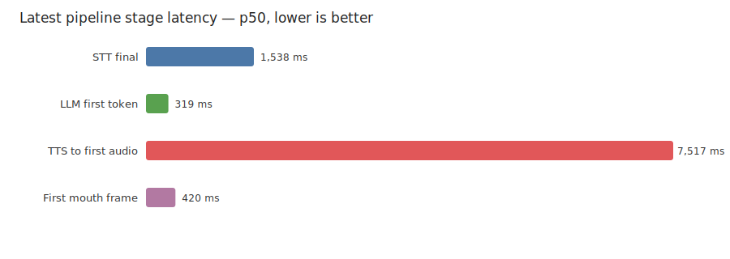
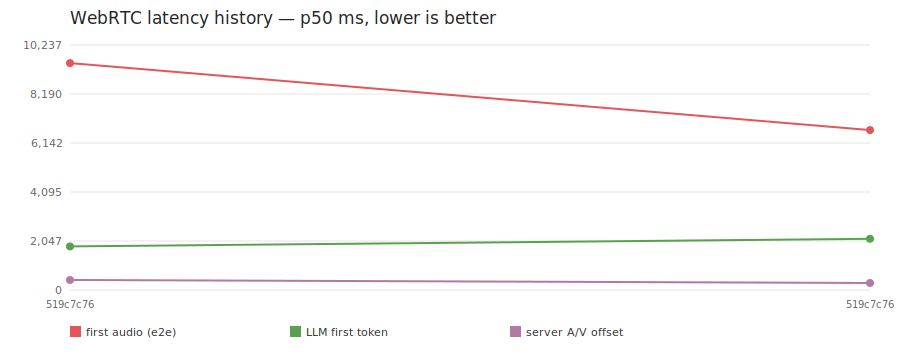

# Max WebRTC benchmark history

Generated from schema-v1 benchmark JSON. Latencies are p50 in milliseconds; lower is better.

## Latest finding

The dominant measured stage is **TTS to first audio** at **4,408 ms p50**. 3/3 samples succeeded and the deployment recorded 0 restarts during the batch.

## Viewer latency and lip sync

| run (UTC) | deployment | LLM model | revision | n | STT final | LLM first token | speech→audio | speech→mouth | server A/V offset | browser A/V offset | quality |
|---|---|---|---|---:|---:|---:|---:|---:|---:|---:|---|
| 2026-07-17 08:14 | codex | mistral-3-14B | [519c7c76](runs/20260717T081400Z-519c7c7-webrtc.json) | 3 | 1,689 | 2,141 | 6,681 | 10,317 | 293 | 379 | ⚠ provisional |
| 2026-07-16 22:20 | codex | mistral-3-14B | [519c7c76](runs/20260716T222024Z-519c7c7-webrtc.json) | 3 | 1,538 | 1,822 | 9,479 | 12,783 | 420 | 1,082 | ⚠ provisional |

## Renderer health

| run (UTC) | revision | Wav2Lip mean/frame | video encode mean/frame | effective FPS | dropped ticks | browser offset range |
|---|---|---:|---:|---:|---:|---:|
| 2026-07-17 08:14 | 519c7c76 | 75 | 5 | 17.2 | 182 | 298–8,175 |
| 2026-07-16 22:20 | 519c7c76 | 75 | 5 | 16.9 | 263 | 350–4,124 |

## Metric definitions and quality

- **STT final**, **LLM first token**, **first audio**, and **first mouth** start at the deterministic input's end-of-speech boundary.
- **Server A/V offset** is first generated Wav2Lip mouth frame minus audio handoff. Positive values mean the mouth trails audio.
- **Browser A/V offset** is received mouth-motion onset minus received audio onset. It is the closest measure of viewer experience, but fixed-region motion detection can miss onset when the avatar moves; a sample spread above 1,500 ms is marked provisional and the full range is shown.
- **Wav2Lip/frame** and **video encode/frame** are renderer costs. Effective FPS and dropped ticks expose whether the deployment keeps up with the nominal 25 FPS schedule.
- Raw schema-v1 JSON is linked from each revision. Measurements from different benchmark implementations should only be compared when their definitions and prompt audio match.
