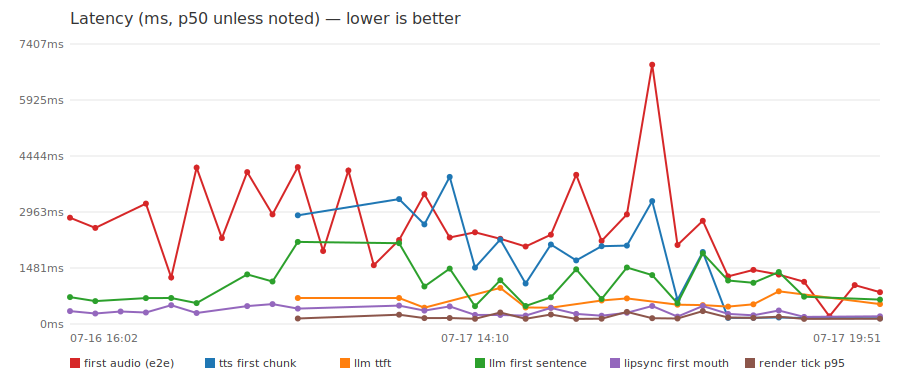
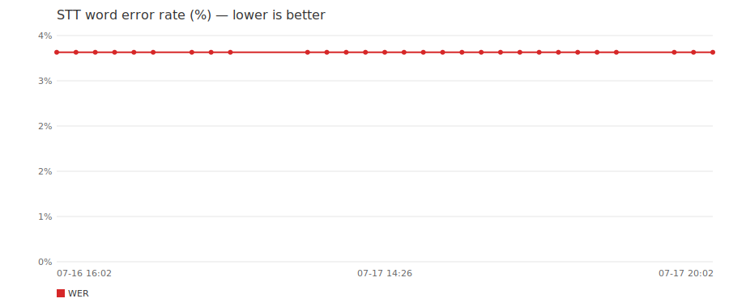
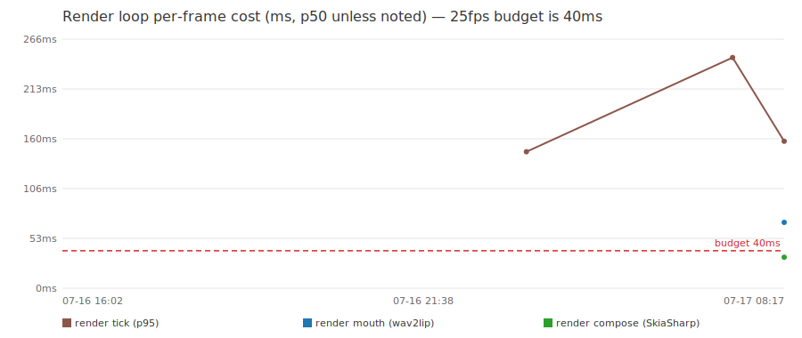
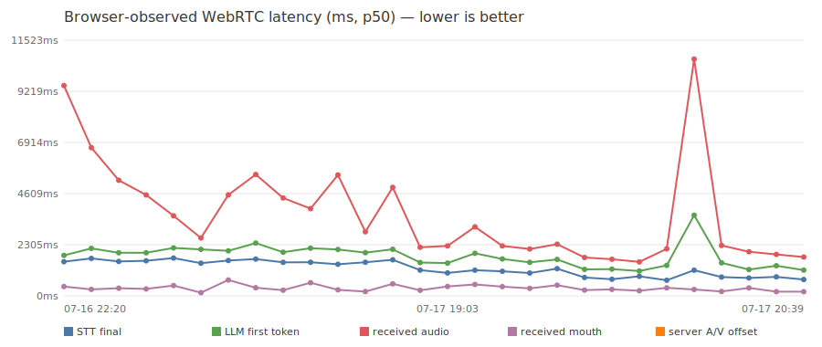

# Max bench history

Regenerated by `.github/workflows/bench.yml` after every run. All latencies are p50 in ms. See [README.md](README.md) for the two complementary measurement methods.

| run (UTC) | label | LLM model | TTS | STT | first audio (e2e) | llm ttft | llm first | tts first chunk | lipsync first | render tick p95 | render mouth | render compose | WER |
|---|---|---|---|---|---|---|---|---|---|---|---|---|---|
| 2026-07-17 20:21 | codex-stt400-7-b2bd2e56-b2bd2e56 | mistral-3-14B | elevenlabs (21m00Tcm4TlvDq8ikWAM) | elevenlabs (scribe_v1) | 2656 | — | 2215 | 178 | 319 | 137 | 63 | 28 | 3.7 % |
| 2026-07-17 20:15 | codex-stt400-repeat-b2bd2e56-b2bd2e56 | mistral-3-14B | elevenlabs (21m00Tcm4TlvDq8ikWAM) | elevenlabs (scribe_v1) | 846 | — | 736 | 153 | 261 | 164 | 68 | 30 | 3.7 % |
| 2026-07-17 20:11 | kimi-exp3-deepseek-flash-190fc5bc | deepseek-4-flash | — | — | 3116 | 1624 | 4093 | 164 | 234 | 144 | 66 | 29 | 3.7 % |
| 2026-07-17 20:05 | codex-stt300-b2bd2e56-b2bd2e56 | mistral-3-14B | elevenlabs (21m00Tcm4TlvDq8ikWAM) | elevenlabs (scribe_v1) | 819 | — | 621 | 142 | 234 | 153 | 65 | 30 | 3.7 % |
| 2026-07-17 20:02 | kimi-exp3-gpt54-nano-190fc5bc | openai-gpt-5.4-nano | — | — | 631 | — | 304 | 164 | 244 | 154 | 66 | 29 | 3.7 % |
| 2026-07-17 19:55 | codex-stt400-b2bd2e56-b2bd2e56 | mistral-3-14B | elevenlabs (21m00Tcm4TlvDq8ikWAM) | elevenlabs (scribe_v1) | 1084 | — | 592 | 175 | 244 | 142 | 61 | 27 | 3.7 % |
| 2026-07-17 19:51 | kimi-exp2-stt-400ms-190fc5bc | mistral-3-14B | — | — | 841 | 526 | 644 | 151 | 205 | 141 | 66 | 28 | 3.7 % |
| 2026-07-17 19:46 | codex/development-1250864d | mistral-3-14B | elevenlabs (21m00Tcm4TlvDq8ikWAM) | elevenlabs (scribe_v1) | 1028 | — | — | — | — | — | — | — | — |
| 2026-07-17 19:42 | codex/development-1250864d | mistral-3-14B | elevenlabs-streaming (21m00Tcm4TlvDq8ikWAM) | elevenlabs-streaming (scribe_v2_realtime) | 204 | — | — | — | — | — | — | — | — |
| 2026-07-17 19:27 | codex-baseline-1250864d | mistral-3-14B | elevenlabs (21m00Tcm4TlvDq8ikWAM) | elevenlabs (scribe_v1) | 1117 | — | 722 | 159 | 187 | 136 | 60 | 26 | 3.7 % |
| 2026-07-17 19:15 | claude/maxheadroom-46dad9c6 | llama-4-maverick | elevenlabs (N2lVS1w4EtoT3dr4eOWO) | elevenlabs (scribe_v1) | 1306 | 866 | 1376 | 172 | 357 | 193 | 73 | 30 | 3.7 % |
| 2026-07-17 19:01 | claude/maxheadroom-46dad9c6 | llama-4-maverick | elevenlabs (21m00Tcm4TlvDq8ikWAM) | elevenlabs (scribe_v1) | 1430 | 522 | 1089 | 164 | 230 | 162 | 66 | 26 | 3.7 % |
| 2026-07-17 18:46 | claude/maxheadroom-46dad9c6 | llama-4-maverick | — | — | 1258 | 461 | 1152 | 162 | 266 | 172 | 66 | 27 | 3.7 % |
| 2026-07-17 16:41 | claude/maxheadroom-46dad9c6 | llama-4-maverick | — | — | 2729 | 500 | 1869 | 1905 | 475 | 342 | 66 | 30 | 3.7 % |
| 2026-07-17 16:35 | kimi/dev-13f4222b | mistral-3-14B | — | — | 2089 | 510 | 547 | 637 | 196 | 146 | 68 | 28 | 3.7 % |
| 2026-07-17 16:30 | codex/development-1250864d | mistral-3-14B | — | — | 6858 | — | 1293 | 3250 | 475 | 154 | 64 | 27 | 3.7 % |
| 2026-07-17 15:23 | claude/maxheadroom-46dad9c6 | llama-4-maverick | — | — | 2900 | 678 | 1495 | 2073 | 298 | 321 | 70 | 27 | 3.7 % |
| 2026-07-17 15:18 | kimi/dev-7fee2d58 | mistral-3-14B | — | — | 2197 | 623 | 661 | 2059 | 218 | 141 | 68 | 34 | 3.7 % |
| 2026-07-17 15:13 | codex/development-801b3c3 | — | — | — | 3948 | — | 1446 | 1682 | 266 | 134 | 60 | 26 | 3.7 % |
| 2026-07-17 14:55 | claude/maxheadroom-46dad9c6 | llama-4-maverick | — | — | 2363 | 431 | 706 | 2104 | 425 | 252 | 62 | 26 | 3.7 % |
| 2026-07-17 14:39 | kimi/dev-7fee2d58 | mistral-3-14B | — | — | 2051 | 437 | 476 | 1072 | 222 | 138 | 65 | 30 | 3.7 % |
| 2026-07-17 14:26 | claude-video-retry-61e531b4 | llama-4-maverick | — | — | 2253 | 954 | 1157 | 2235 | 238 | 306 | 65 | 28 | 3.7 % |
| 2026-07-17 14:10 | codex/development-801b3c3 | — | — | — | 2426 | — | 470 | 1493 | 241 | 138 | 61 | 26 | 3.7 % |
| 2026-07-17 13:17 | codex-prompt-silence-fix-801b3c3 | — | — | — | 2289 | — | 1466 | 3891 | 467 | 160 | 67 | 28 | 3.7 % |
| 2026-07-17 08:17 | b9fefb34 | llama-4-maverick | — | — | 3433 | 430 | 992 | 2636 | 354 | 157 | 70 | 33 | 3.7 % |
| 2026-07-17 07:53 | 247060c6 | llama-4-maverick | — | — | 2223 | 688 | 2137 | 3303 | 486 | 246 | — | — | 3.7 % |
| 2026-07-17 05:57 | 7049f658 | — | — | — | 1555 | — | — | — | — | — | — | — | — |
| 2026-07-16 22:34 | f3c2cf28 | llama-4-maverick | — | — | 4061 | — | — | — | — | — | — | — | — |
| 2026-07-16 22:30 | 95db1d1a | llama-4-maverick | — | — | 1931 | — | — | — | — | — | — | — | — |
| 2026-07-16 22:24 | 4d693ef9 | llama-4-maverick | — | — | 4151 | 688 | 2171 | 2876 | 406 | 146 | — | — | 3.7 % |
| 2026-07-16 21:55 | ca76a568 | llama-4-maverick | — | — | 2899 | — | 1123 | — | 526 | — | — | — | 3.7 % |
| 2026-07-16 21:38 | 130cbc08 | — | — | — | 4017 | — | 1311 | — | 474 | — | — | — | 3.7 % |
| 2026-07-16 21:34 | 130cbc08 | — | — | — | 2273 | — | — | — | — | — | — | — | — |
| 2026-07-16 21:20 | a34f006a | — | — | — | 4137 | — | 553 | — | 291 | — | — | — | 3.7 % |
| 2026-07-16 21:10 | b74650da | — | — | — | 1230 | — | 687 | — | 497 | — | — | — | 3.7 % |
| 2026-07-16 16:36 | 8a394322 | — | — | — | 3185 | — | 686 | — | 305 | — | — | — | 3.7 % |
| 2026-07-16 16:26 | 16076c2 | — | — | — | — | — | — | — | 330 | — | — | — | 3.7 % |
| 2026-07-16 16:12 | d9a3bcb | — | — | — | 2543 | — | 605 | — | 278 | — | — | — | 3.7 % |
| 2026-07-16 16:02 | 3518bb1 | — | — | — | 2812 | — | 711 | — | 340 | — | — | — | 3.7 % |

## Browser-observed WebRTC suite

This suite drives a real headless Chrome WebRTC viewer with deterministic speech. Its clock starts when that speech ends, so its results are intentionally shown separately from the HTTP suite above.

| run (UTC) | deployment | LLM model | TTS | STT | revision | n | STT final | LLM first token | received audio | received mouth | server A/V offset | browser A/V offset | quality |
|---|---|---|---|---|---|---:|---:|---:|---:|---:|---:|---:|---|
| 2026-07-17 20:23 | codex-stt400-7-b2bd2e56 | mistral-3-14B | elevenlabs (21m00Tcm4TlvDq8ikWAM) | elevenlabs (scribe_v1) | b2bd2e56 | 7 | 809 | 1187 | 1990 | 2537 | 358 | 370 | consistent |
| 2026-07-17 20:18 | codex-stt400-repeat-b2bd2e56 | mistral-3-14B | elevenlabs (21m00Tcm4TlvDq8ikWAM) | elevenlabs (scribe_v1) | b2bd2e56 | 3 | 846 | 1489 | 2270 | 2601 | 198 | 110 | consistent |
| 2026-07-17 20:14 | kimi-exp3-deepseek-flash | deepseek-4-flash | — | — | 190fc5bc | 3 | 1158 | 3635 | 10670 | 10883 | 288 | 214 | consistent |
| 2026-07-17 20:08 | codex-stt300-b2bd2e56 | mistral-3-14B | elevenlabs (21m00Tcm4TlvDq8ikWAM) | elevenlabs (scribe_v1) | b2bd2e56 | 3 | 705 | 1373 | 2120 | 2542 | 361 | 273 | consistent |
| 2026-07-17 20:04 | kimi-exp3-gpt54-nano | openai-gpt-5.4-nano | — | — | 190fc5bc | 3 | 882 | 1120 | 1530 | 1660 | 229 | 106 | consistent |
| 2026-07-17 19:57 | codex-stt400-b2bd2e56 | mistral-3-14B | elevenlabs (21m00Tcm4TlvDq8ikWAM) | elevenlabs (scribe_v1) | b2bd2e56 | 3 | 750 | 1206 | 1649 | 1879 | 290 | 237 | consistent |
| 2026-07-17 19:53 | kimi-exp2-stt-400ms | mistral-3-14B | — | — | 190fc5bc | 3 | 826 | 1195 | 1730 | 1726 | 258 | 196 | consistent |
| 2026-07-17 19:48 | codex/40-stt-endpointing | mistral-3-14B | elevenlabs (21m00Tcm4TlvDq8ikWAM) | elevenlabs (scribe_v1) | b2bd2e56 | 3 | 1228 | 1643 | 2330 | 2798 | 482 | 468 | consistent |
| 2026-07-17 19:44 | codex/development | mistral-3-14B | elevenlabs (21m00Tcm4TlvDq8ikWAM) | elevenlabs (scribe_v1) | 1250864d | 3 | 1031 | 1509 | 2110 | 2397 | 339 | 288 | consistent |
| 2026-07-17 19:30 | codex-baseline | mistral-3-14B | elevenlabs (21m00Tcm4TlvDq8ikWAM) | elevenlabs (scribe_v1) | 1250864d | 3 | 1105 | 1665 | 2250 | 2552 | 418 | 345 | consistent |
| 2026-07-17 19:17 | claude/maxheadroom | llama-4-maverick | elevenlabs (N2lVS1w4EtoT3dr4eOWO) | elevenlabs (scribe_v1) | 46dad9c6 | 1 | 1155 | 1918 | 3109 | 3691 | 515 | 582 | consistent |
| 2026-07-17 19:03 | claude/maxheadroom | llama-4-maverick | elevenlabs (21m00Tcm4TlvDq8ikWAM) | elevenlabs (scribe_v1) | 46dad9c6 | 3 | 1034 | 1476 | 2249 | 2317 | 422 | 144 | consistent |
| 2026-07-17 18:48 | claude/maxheadroom | llama-4-maverick | elevenlabs (21m00Tcm4TlvDq8ikWAM) | elevenlabs (scribe_v1) | 46dad9c6 | 1 | 1159 | 1503 | 2189 | 2356 | 253 | 167 | consistent |
| 2026-07-17 16:43 | claude/maxheadroom | llama-4-maverick | sherpa (vits-piper-en_US-ryan-high) | sherpa (sherpa-onnx-nemo-parakeet-tdt-0.6b-v2-int8) | 46dad9c6 | 3 | 1626 | 2099 | 4890 | 5407 | 542 | 604 | consistent |
| 2026-07-17 16:39 | kimi/dev | mistral-3-14B | sherpa (vits-piper-en_US-ryan-high) | sherpa (sherpa-onnx-nemo-parakeet-tdt-0.6b-v2-int8) | 13f4222b | 3 | 1514 | 1946 | 2890 | 3277 | 191 | 156 | consistent |
| 2026-07-17 16:33 | codex/development | mistral-3-14B | sherpa (vits-piper-en_US-ryan-high) | sherpa (sherpa-onnx-nemo-parakeet-tdt-0.6b-v2-int8) | 1250864d | 3 | 1422 | 2090 | 5450 | 5664 | 271 | 214 | consistent |
| 2026-07-17 15:26 | claude/maxheadroom | llama-4-maverick | sherpa (vits-piper-en_US-ryan-high) | sherpa (sherpa-onnx-nemo-parakeet-tdt-0.6b-v2-int8) | 46dad9c6 | 3 | 1514 | 2148 | 3930 | 4508 | 592 | 578 | consistent |
| 2026-07-17 15:21 | kimi/dev | unknown | unknown (unknown) | unknown (unknown) | 7fee2d58 | 3 | 1511 | 1966 | 4410 | 4614 | 253 | 204 | consistent |
| 2026-07-17 15:16 | codex/development | unknown | unknown (unknown) | unknown (unknown) | 801b3c3 | 3 | 1660 | 2379 | 5470 | 5671 | 368 | 305 | consistent |
| 2026-07-17 14:57 | claude/maxheadroom | llama-4-maverick | sherpa (vits-piper-en_US-ryan-high) | sherpa (sherpa-onnx-nemo-parakeet-tdt-0.6b-v2-int8) | 46dad9c6 | 3 | 1594 | 2029 | 4551 | 5149 | 716 | 598 | consistent |
| 2026-07-17 14:43 | kimi/dev | mistral-3-14B | — | — | 7fee2d58 | 3 | 1474 | 2095 | 2610 | 5565 | 144 | 3196 | provisional: 3266 ms sample spread |
| 2026-07-17 14:27 | claude-video-retry | llama-4-maverick | — | — | 61e531b4 | 1 | 1702 | 2162 | 3609 | 4064 | 467 | 455 | consistent |
| 2026-07-17 14:14 | codex/development | mistral-3-14B | — | — | 801b3c3 | 3 | 1581 | 1940 | 4550 | 4923 | 314 | 454 | consistent |
| 2026-07-17 13:19 | codex-prompt-silence-fix | mistral-3-14B | — | — | 801b3c3 | 1 | 1552 | 1942 | 5209 | 5494 | 345 | 285 | consistent |
| 2026-07-17 08:14 | codex | mistral-3-14B | — | — | 519c7c76 | 3 | 1689 | 2141 | 6681 | 10317 | 293 | 379 | provisional: 7877 ms sample spread |
| 2026-07-16 22:20 | codex | mistral-3-14B | — | — | 519c7c76 | 3 | 1538 | 1822 | 9479 | 12783 | 420 | 1082 | provisional: 3773 ms sample spread |

### Browser renderer health

| run (UTC) | revision | Wav2Lip mean/frame | video encode mean/frame | effective FPS | dropped ticks | target | restarts |
|---|---|---:|---:|---:|---:|---|---|
| 2026-07-17 20:23 | b2bd2e56 | 70 | 5 | 14 | 171 | https://max-codex.sipsorcery.com | not observed |
| 2026-07-17 20:18 | b2bd2e56 | 68 | 4 | 15 | 140 | https://max-codex.sipsorcery.com | not observed |
| 2026-07-17 20:14 | 190fc5bc | 72 | 4 | 20 | 106 | https://max-kimi.sipsorcery.com | not observed |
| 2026-07-17 20:08 | b2bd2e56 | 71 | 4 | 15 | 143 | https://max-codex.sipsorcery.com | not observed |
| 2026-07-17 20:04 | 190fc5bc | 76 | 4 | 19 | 44 | https://max-kimi.sipsorcery.com | not observed |
| 2026-07-17 19:57 | b2bd2e56 | 68 | 5 | 15 | 124 | https://max-codex.sipsorcery.com | not observed |
| 2026-07-17 19:53 | 190fc5bc | 77 | 5 | 16 | 121 | https://max-kimi.sipsorcery.com | not observed |
| 2026-07-17 19:48 | b2bd2e56 | 69 | 4 | 15 | 135 | https://max-codex.sipsorcery.com | not observed |
| 2026-07-17 19:44 | 1250864d | 68 | 4 | 15 | 137 | https://max-codex.sipsorcery.com | not observed |
| 2026-07-17 19:30 | 1250864d | 65 | 5 | 15 | 133 | https://max-codex.sipsorcery.com | not observed |
| 2026-07-17 19:17 | 46dad9c6 | 76 | 5 | 16 | 123 | https://max-claude.sipsorcery.com | not observed |
| 2026-07-17 19:03 | 46dad9c6 | 70 | 5 | 16 | 119 | https://max-claude.sipsorcery.com | not observed |
| 2026-07-17 18:48 | 46dad9c6 | 71 | 5 | 15 | 136 | https://max-claude.sipsorcery.com | not observed |
| 2026-07-17 16:43 | 46dad9c6 | 119 | 5 | 16 | 113 | https://max-claude.sipsorcery.com | not observed |
| 2026-07-17 16:39 | 13f4222b | 76 | 5 | 17 | 114 | https://max-kimi.sipsorcery.com | not observed |
| 2026-07-17 16:33 | 1250864d | 66 | 4 | 18 | 125 | https://max-codex.sipsorcery.com | not observed |
| 2026-07-17 15:26 | 46dad9c6 | 151 | 6 | 15 | 149 | https://max-claude.sipsorcery.com | not observed |
| 2026-07-17 15:21 | 7fee2d58 | 73 | 5 | 17 | 112 | https://max-kimi.sipsorcery.com | not observed |
| 2026-07-17 15:16 | 801b3c3 | 84 | 5 | 16 | 177 | https://max-codex.sipsorcery.com | not observed |
| 2026-07-17 14:57 | 46dad9c6 | 128 | 6 | 15 | 167 | https://max-claude.sipsorcery.com | not observed |
| 2026-07-17 14:43 | 7fee2d58 | 72 | 5 | 18 | 131 | https://max-kimi.sipsorcery.com | not observed |
| 2026-07-17 14:27 | 61e531b4 | 98 | 6 | 16 | 135 | https://max-claude.sipsorcery.com | not observed |
| 2026-07-17 14:14 | 801b3c3 | 70 | 5 | 16 | 159 | https://max-codex.sipsorcery.com | not observed |
| 2026-07-17 13:19 | 801b3c3 | 66 | 5 | 16 | 201 | https://max-codex.sipsorcery.com | not observed |
| 2026-07-17 08:14 | 519c7c76 | 75 | 5 | 17 | 182 | https://max-codex.sipsorcery.com | 0 |
| 2026-07-16 22:20 | 519c7c76 | 75 | 5 | 17 | 263 | https://max-codex.sipsorcery.com | 0 |

## Metric definitions

All latency figures are the p50 (median) across the prompts/windows in one bench run, in milliseconds unless noted. See [bench/README.md](https://github.com/sipsorcery/maxheadroom/blob/master/bench/README.md) for how each is measured.

- **LLM model** — which model generated the replies for that run (`GET /version`'s `llmModel`: the in-process GGUF filename, or the configured endpoint model name). Model swaps are a config change, not a code change, so this is the only thing that tells two runs with the same commit label apart. Runs from before this field existed show `—`.
- **TTS / STT** — the speech engine (and voice/model) actually running for that run (`GET /version`'s `models.ttsEngine`/`ttsVoice`/`sttEngine`/`sttModel`), e.g. `sherpa (vits-piper-en_US-ryan-high)` or `elevenlabs (21m00Tcm4TlvDq8ikWAM)`. An engine swap (sherpa ↔ ElevenLabs) is a config change like the LLM model, not a code change, and materially shifts every downstream latency number - always check this column before comparing runs. Runs from before this field existed show `—`; runs from a target whose server doesn't yet expose `models` show `unknown`.
- **first audio (e2e)** — *end-to-end LLM reply latency.* Wall-clock time from the bench posting a prompt to `/ask` until the first audible (non-silent) audio packet arrives over the WebRTC connection. The single number that best represents "how long the viewer waits before Max starts talking."
- **llm ttft** — time to the LLM's first token off the wire (`llm_ttft`). The purest measure of model/endpoint responsiveness; program target <400ms.
- **llm first** — server-side time from prompt received to the first *sentence* of the LLM's reply becoming available for speech (`llm_first_sentence`). The gap above *llm ttft* is sentence-chunking cost - the wait for the whole first sentence to generate.
- **tts first chunk** — time from an utterance starting until the first playable audio exists (`tts_first_chunk`). For blocking engines (sherpa) this equals whole-sentence synthesis; for streaming engines (ElevenLabs) it is the first websocket chunk. Program target <300ms. (Full synth cost remains in the run JSON as `tts_synth`.)
- **lipsync first** — time from an utterance's audio being handed to the avatar renderer until the first lip-synced (Wav2Lip) mouth frame is ready (`lipsync_first_mouth`). Governs how quickly the avatar's mouth starts moving once it begins speaking.
- **render tick p95** — 95th percentile of the whole per-frame render cost while speaking: mouth inference + frame compose + video encode (`render_tick`). The budget at 25fps is 40ms; a p95 above that means dropped frames and a laggy face.
- **render mouth** — the render tick's mouth-inference stage (`render_mouth`): the Wav2Lip ONNX call (or reusing the last mouth when no new audio window is ready yet). Tracks `wav2lip_infer` closely; currently the single largest render-tick cost.
- **render compose** — the render tick's SkiaSharp compositing stage (`render_compose`): matte blend, VHS grade, head-sway warp, blinks. All per-pixel managed code today - the second-largest render-tick cost and a live optimization target (see the [render chart](charts/render.svg) and the 40ms budget line).
- **WER** — *word error rate* of speech-to-text. The bench sends a fixed reference audio clip (Harvard sentences, `bench/corpus.json`) through the same offline recogniser the live WebRTC audio path uses, then scores the transcript against the known-correct reference text. Lower is better; 0% is a perfect transcript.
- **Browser WebRTC STT final / LLM first token / received audio / received mouth** — elapsed from the injected prompt's end-of-speech boundary to, respectively, the server STT final event, server LLM first-token event, the first audible audio the browser receives, and the first mouth-motion onset the browser detects. These expose the actual viewer path but must not be numerically compared to the HTTP suite's prompt-POST start point.
- **Browser A/V offset** — received mouth-motion onset minus received audio onset. It is closest to the viewer experience, but fixed-region motion detection can miss onset; its quality flag is provisional when sample spread is above 1,500 ms. **Server A/V offset** is first generated Wav2Lip mouth frame minus server audio handoff.
